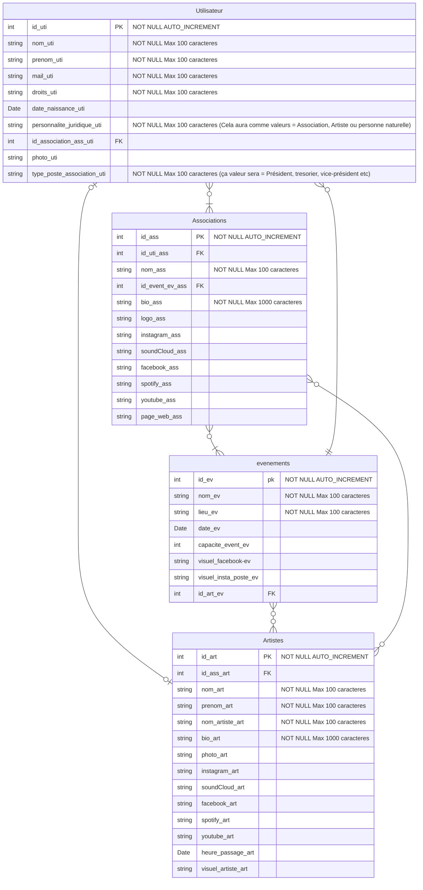
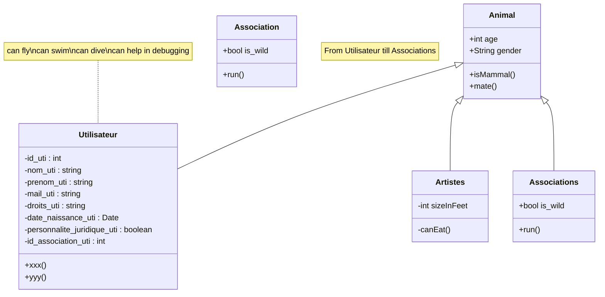

# Projet Asso
## BDD

```mermaid
erDiagram
    Utilisateur }o--|{ Associations : ""
    Utilisateur |o--o| Artistes : ""
    Utilisateur {
        int id_uti PK "NOT NULL AUTO_INCREMENT"
        string nom_uti "NOT NULL Max 100 caracteres"
        string prenom_uti "NOT NULL Max 100 caracteres"
        string mail_uti "NOT NULL Max 100 caracteres"
        string droits_uti "NOT NULL Max 100 caracteres"
        Date date_naissance_uti
        string personnalite_juridique_uti "NOT NULL Max 100 caracteres (Cela aura comme valeurs = Association, Artiste ou personne naturelle)"
        int id_association_ass_uti FK
        string photo_uti 
        string type_poste_association_uti "NOT NULL Max 100 caracteres (ça valeur sera = Président, tresorier, vice-président etc)"
    }

    Artistes }o--o{ Associations : ""
    Artistes {
        int id_art PK "NOT NULL AUTO_INCREMENT"
        int id_ass_art FK
        string nom_art "NOT NULL Max 100 caracteres"
        string prenom_art "NOT NULL Max 100 caracteres"
        string nom_artiste_art "NOT NULL Max 100 caracteres"
        string bio_art "NOT NULL Max 1000 caracteres"
        string photo_art 
        string instagram_art
        string soundCloud_art
        string facebook_art
        string spotify_art
        string youtube_art
        Date heure_passage_art
        string visuel_artiste_art

    }

    Associations }o--|{ evenements : ""
    Associations {
        int id_ass PK "NOT NULL AUTO_INCREMENT"
        int id_uti_ass FK
        string nom_ass "NOT NULL Max 100 caracteres"
        int id_event_ev_ass FK
        string bio_ass "NOT NULL Max 1000 caracteres"
        string logo_ass
        string instagram_ass
        string soundCloud_ass
        string facebook_ass
        string spotify_ass
        string youtube_ass 
        string page_web_ass

    }

    evenements }o--o{ Artistes : ""
    evenements ||--o{ Utilisateur : ""
    evenements {
        int id_ev pk "NOT NULL AUTO_INCREMENT"
        string nom_ev "NOT NULL Max 100 caracteres"
        string lieu_ev "NOT NULL Max 100 caracteres"
        Date date_ev
        int capacite_event_ev
        string visuel_facebook-ev
        string visuel_insta_poste_ev
        int id_art_ev FK
    }


```
## Diagrame de classes

```mermaid
classDiagram
    note "From Utilisateur till Associations "
    Animal <|-- Utilisateur
    note for Utilisateur "can fly\ncan swim\ncan dive\ncan help in debugging"
    Animal <|-- Artistes
    Animal <|-- Associations 
    Animal : +int age
    Animal : +String gender
    Animal: +isMammal()
    Animal: +mate()
    class Utilisateur{
        -id_uti : int
        -nom_uti : string
        -prenom_uti : string
        -mail_uti : string
        -droits_uti : string
        -date_naissance_uti : Date
        -personnalite_juridique_uti : boolean
        -id_association_uti : int
        +xxx()
        +yyy()
    }
    class Artistes{
        -int sizeInFeet
        -canEat()
    }
    class Association {
        +bool is_wild
        +run()
    }
    class Associations {
        +bool is_wild
        +run()
    }

```